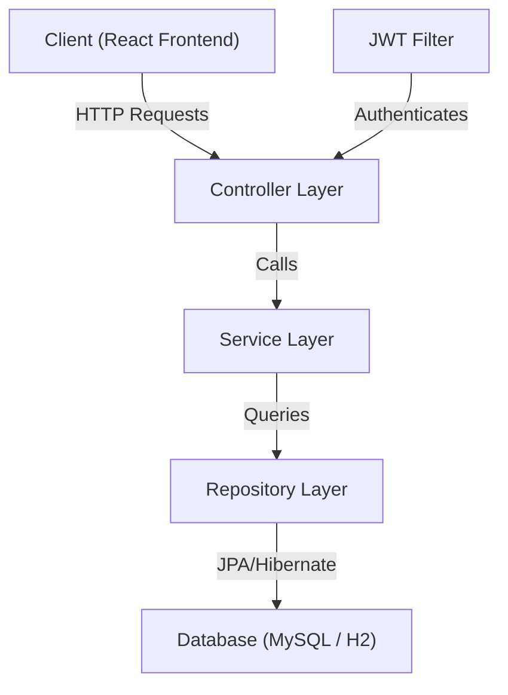
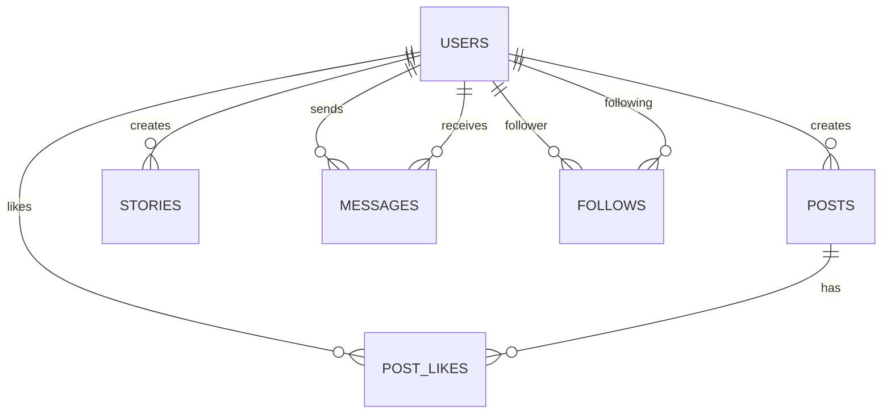
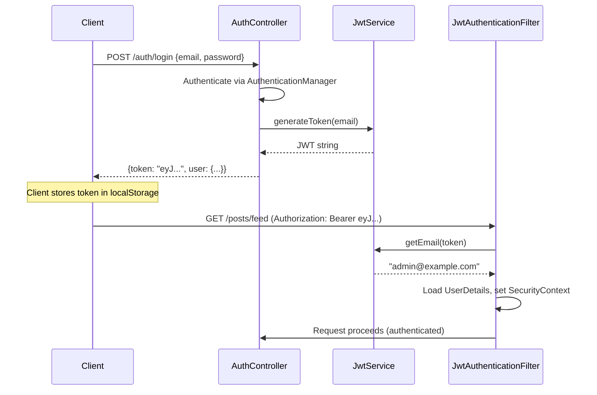

# PingUp Backend — Detailed Documentation

## 1. Overview

PingUp is a social media application with a **Spring Boot 2.7.18** REST API backend written in **Java 8+**. It provides endpoints for authentication, user profiles, posts, stories, direct messages, and follow/connection management.

**Base URL:** `http://localhost:8080/api`

---

## 2. Tech Stack

| Technology | Version | Purpose |
|---|---|---|
| Spring Boot | 2.7.18 | Application framework |
| Spring Data JPA | (managed) | ORM / database access |
| Spring Security | (managed) | Authentication & authorization |
| Hibernate | (managed) | JPA implementation |
| MySQL | 8.0 | Primary database |
| H2 | (managed) | In-memory dev database (optional) |
| JJWT | 0.11.5 | JWT token creation & validation |
| BCrypt | (managed) | Password hashing |
| Maven | 3.8+ | Build tool |
| Docker Compose | — | MySQL container orchestration |

---

## 3. Project Structure

```
backend/
├── pom.xml                          # Maven dependencies
├── docker-compose.yml               # MySQL container
├── database/
│   └── init.sql                     # DB + user creation script
└── src/main/
    ├── resources/
    │   ├── application.properties       # MySQL config (default)
    │   └── application-h2.properties    # H2 config (optional profile)
    └── java/com/pingup/
        ├── PingUpApplication.java       # Entry point
        ├── config/
        │   ├── SecurityConfig.java      # CORS, session, filter chain
        │   └── DataSeeder.java          # Demo data on first startup
        ├── entity/                      # JPA entities (DB tables)
        │   ├── User.java
        │   ├── Post.java
        │   ├── PostLike.java
        │   ├── Story.java
        │   ├── Message.java
        │   └── Follow.java
        ├── repository/                  # Spring Data JPA interfaces
        │   ├── UserRepository.java
        │   ├── PostRepository.java
        │   ├── PostLikeRepository.java
        │   ├── StoryRepository.java
        │   ├── MessageRepository.java
        │   └── FollowRepository.java
        ├── service/                     # Business logic
        │   ├── AuthService.java
        │   ├── UserService.java
        │   ├── PostService.java
        │   ├── StoryService.java
        │   ├── MessageService.java
        │   └── FollowService.java
        ├── controller/                  # REST endpoints
        │   ├── AuthController.java
        │   ├── UserController.java
        │   ├── PostController.java
        │   ├── StoryController.java
        │   ├── MessageController.java
        │   └── ConnectionController.java
        ├── dto/                         # Request/Response objects
        │   ├── AuthDtos.java
        │   ├── UserDtos.java
        │   ├── UserResponse.java
        │   ├── PostDtos.java
        │   ├── StoryDtos.java
        │   ├── MessageDtos.java
        │   └── Mapper.java
        ├── security/                    # JWT authentication
        │   ├── JwtService.java
        │   ├── JwtAuthenticationFilter.java
        │   └── CustomUserDetailsService.java
        └── exception/                   # Error handling
            ├── ApiException.java
            └── GlobalExceptionHandler.java
```

---

## 4. Architecture (Layered Pattern)

The backend follows a classic **4-layer architecture**:



| Layer | Responsibility |
|---|---|
| **Controller** | Receives HTTP requests, validates input (`@Valid`), delegates to service |
| **Service** | Business logic, authorization checks, data transformation |
| **Repository** | Database queries via Spring Data JPA (auto-generated SQL) |
| **Entity** | Maps Java classes to database tables (`@Entity`) |
| **DTO** | Shapes data for API requests and responses (decoupled from entities) |

---

## 5. Database Entities (Tables)

### 5.1 `users` Table — [User.java](file:///c:/Users/yousu/OneDrive/Desktop/ping-Up-main/backend/src/main/java/com/pingup/entity/User.java)

| Column | Type | Constraints | Description |
|---|---|---|---|
| `id` | Long (auto) | PK | Primary key |
| `email` | String | unique, not null | Login email |
| `username` | String | unique, not null | Display handle |
| `fullName` | String | not null | Display name |
| `passwordHash` | String | not null | BCrypt hash |
| `bio` | String(500) | — | Profile bio |
| `profilePicture` | String | — | Avatar URL |
| `coverPhoto` | String | — | Cover image URL |
| `location` | String | — | User location |
| `website` | String | — | User website |
| `verified` | boolean | — | Blue check status |
| `privateAccount` | boolean | — | Private mode |
| `createdAt` | Instant | auto-set | Account creation time |
| `updatedAt` | Instant | auto-set | Last update time |

### 5.2 `posts` Table — [Post.java](file:///c:/Users/yousu/OneDrive/Desktop/ping-Up-main/backend/src/main/java/com/pingup/entity/Post.java)

| Column | Type | Constraints | Description |
|---|---|---|---|
| `id` | Long (auto) | PK | Primary key |
| `user_id` | Long | FK → users, not null | Post author |
| `content` | String(3000) | — | Text content |
| `imageUrls` | List&lt;String&gt; | `@ElementCollection` | Attached image URLs |
| `videoUrl` | String | — | Attached video URL |
| `postType` | String | — | `text`, `image`, `text_with_image`, `video` |
| `createdAt` | Instant | auto-set | Creation time |
| `updatedAt` | Instant | auto-set | Last edit time |

### 5.3 `post_likes` Table — [PostLike.java](file:///c:/Users/yousu/OneDrive/Desktop/ping-Up-main/backend/src/main/java/com/pingup/entity/PostLike.java)

| Column | Type | Constraints | Description |
|---|---|---|---|
| `id` | Long (auto) | PK | Primary key |
| `post_id` | Long | FK → posts, unique with user_id | Liked post |
| `user_id` | Long | FK → users, unique with post_id | User who liked |
| `createdAt` | Instant | auto-set | Like time |

### 5.4 `stories` Table — [Story.java](file:///c:/Users/yousu/OneDrive/Desktop/ping-Up-main/backend/src/main/java/com/pingup/entity/Story.java)

| Column | Type | Constraints | Description |
|---|---|---|---|
| `id` | Long (auto) | PK | Primary key |
| `user_id` | Long | FK → users, not null | Story author |
| `content` | String(1000) | — | Text overlay |
| `mediaUrl` | String | — | Image/video URL |
| `mediaType` | String | — | `text`, `image`, `video` |
| `backgroundColor` | String | — | Background hex color |
| `createdAt` | Instant | auto-set | Creation time |
| `expiresAt` | Instant | auto-set (24h) | Expiration time |

### 5.5 `messages` Table — [Message.java](file:///c:/Users/yousu/OneDrive/Desktop/ping-Up-main/backend/src/main/java/com/pingup/entity/Message.java)

| Column | Type | Constraints | Description |
|---|---|---|---|
| `id` | Long (auto) | PK | Primary key |
| `sender_id` | Long | FK → users, not null | Message sender |
| `receiver_id` | Long | FK → users, not null | Message receiver |
| `text` | String(3000) | — | Message text |
| `mediaUrl` | String | — | Attached media URL |
| `messageType` | String | — | `text`, `image`, `video` |
| `seen` | boolean | — | Read receipt |
| `createdAt` | Instant | auto-set | Sent time |

### 5.6 `follows` Table — [Follow.java](file:///c:/Users/yousu/OneDrive/Desktop/ping-Up-main/backend/src/main/java/com/pingup/entity/Follow.java)

| Column | Type | Constraints | Description |
|---|---|---|---|
| `id` | Long (auto) | PK | Primary key |
| `follower_id` | Long | FK → users, unique pair | Who follows |
| `following_id` | Long | FK → users, unique pair | Who is followed |
| `status` | String | — | `ACCEPTED` or `PENDING` |
| `createdAt` | Instant | auto-set | Follow time |

### Entity Relationships Diagram



---

## 6. Repository Layer

All repositories extend `JpaRepository<Entity, Long>`, giving free CRUD + pagination. Custom query methods:

### [UserRepository](file:///c:/Users/yousu/OneDrive/Desktop/ping-Up-main/backend/src/main/java/com/pingup/repository/UserRepository.java)
- `findByEmail(email)` — login lookup
- `findByUsername(username)` — profile lookup
- `existsByEmail / existsByUsername` — uniqueness checks
- `findTop30By...ContainingIgnoreCase(...)` — search across name, username, bio, location (max 30 results)

### [PostRepository](file:///c:/Users/yousu/OneDrive/Desktop/ping-Up-main/backend/src/main/java/com/pingup/repository/PostRepository.java)
- `findAllByOrderByCreatedAtDesc()` — feed (all posts, newest first)
- `findByUserOrderByCreatedAtDesc(user)` — a user's posts

### [PostLikeRepository](file:///c:/Users/yousu/OneDrive/Desktop/ping-Up-main/backend/src/main/java/com/pingup/repository/PostLikeRepository.java)
- `findByPostAndUser(post, user)` — check/toggle a specific like
- `countByPost(post)` — total likes on a post
- `existsByPostAndUser(post, user)` — has current user liked this?

### [StoryRepository](file:///c:/Users/yousu/OneDrive/Desktop/ping-Up-main/backend/src/main/java/com/pingup/repository/StoryRepository.java)
- `findByExpiresAtAfterOrderByCreatedAtDesc(now)` — only non-expired stories

### [MessageRepository](file:///c:/Users/yousu/OneDrive/Desktop/ping-Up-main/backend/src/main/java/com/pingup/repository/MessageRepository.java)
- `findConversation(userA, userB)` — all messages between two users (JPQL)
- `findRecentForUser(user)` — all messages involving user, newest first (JPQL)

### [FollowRepository](file:///c:/Users/yousu/OneDrive/Desktop/ping-Up-main/backend/src/main/java/com/pingup/repository/FollowRepository.java)
- `findByFollowerAndFollowing(a, b)` — lookup a specific follow relationship
- `countByFollowingAndStatus / countByFollowerAndStatus` — follower/following counts
- `findByFollowingAndStatus / findByFollowerAndStatus` — list followers/following

---

## 7. Service Layer (Business Logic)

### [AuthService](file:///c:/Users/yousu/OneDrive/Desktop/ping-Up-main/backend/src/main/java/com/pingup/service/AuthService.java)
- **`register()`** — checks email/username uniqueness → creates user with BCrypt password → returns JWT + user data
- **`login()`** — authenticates via `AuthenticationManager` → returns JWT + user data

### [UserService](file:///c:/Users/yousu/OneDrive/Desktop/ping-Up-main/backend/src/main/java/com/pingup/service/UserService.java)
- **`currentUser()`** — resolves the logged-in user from `SecurityContext`. Falls back to first user in DB if anonymous (for demo purposes)
- **`me()`** — returns the current user's profile with follower/following counts
- **`getProfile(id)`** — returns any user's profile
- **`search(query)`** — searches users by name, username, bio, or location (top 30 matches)
- **`updateMe()`** — updates profile fields (fullName, username, bio, profilePicture, coverPhoto, location, website, privateAccount)

### [PostService](file:///c:/Users/yousu/OneDrive/Desktop/ping-Up-main/backend/src/main/java/com/pingup/service/PostService.java)
- **`feed()`** — all posts, newest first, with like counts
- **`byUser(userId)`** — a specific user's posts
- **`create()`** — creates a post, auto-detects `postType` from content (text/image/video)
- **`update(id)`** — edits own post only (ownership check)
- **`delete(id)`** — deletes own post only (ownership check)
- **`toggleLike(id)`** — likes if not already liked, unlikes if already liked

### [StoryService](file:///c:/Users/yousu/OneDrive/Desktop/ping-Up-main/backend/src/main/java/com/pingup/service/StoryService.java)
- **`activeStories()`** — returns only stories where `expiresAt > now` (auto-expires after 24h)
- **`create()`** — creates a story with content, media, type, and background color

### [MessageService](file:///c:/Users/yousu/OneDrive/Desktop/ping-Up-main/backend/src/main/java/com/pingup/service/MessageService.java)
- **`conversation(userId)`** — full message history between current user and target user
- **`recent()`** — latest message from each unique contact (inbox view)
- **`send()`** — sends a message to a user (text or media)

### [FollowService](file:///c:/Users/yousu/OneDrive/Desktop/ping-Up-main/backend/src/main/java/com/pingup/service/FollowService.java)
- **`follow(userId)`** — follows a user. Status is `ACCEPTED` for public accounts, `PENDING` for private accounts
- **`unfollow(userId)`** — removes the follow relationship
- **`followers(userId)`** — lists all accepted followers of a user
- **`following(userId)`** — lists all users that a user follows

---

## 8. Controller Layer (REST Endpoints)

### 8.1 Auth — [AuthController](file:///c:/Users/yousu/OneDrive/Desktop/ping-Up-main/backend/src/main/java/com/pingup/controller/AuthController.java) — `/auth`

| Method | Endpoint | Body | Response | Description |
|---|---|---|---|---|
| POST | `/auth/register` | `{email, username, fullName, password}` | `{token, user}` | Create account |
| POST | `/auth/login` | `{email, password}` | `{token, user}` | Login |

### 8.2 Users — [UserController](file:///c:/Users/yousu/OneDrive/Desktop/ping-Up-main/backend/src/main/java/com/pingup/controller/UserController.java) — `/users`

| Method | Endpoint | Body/Params | Response | Description |
|---|---|---|---|---|
| GET | `/users/me` | — | `UserResponse` | Current user profile |
| PUT | `/users/me` | `{fullName, username, bio, ...}` | `UserResponse` | Update profile |
| GET | `/users/{id}` | — | `UserResponse` | Any user's profile |
| GET | `/users?q=search` | `?q=` query param | `UserResponse[]` | Search users |

### 8.3 Posts — [PostController](file:///c:/Users/yousu/OneDrive/Desktop/ping-Up-main/backend/src/main/java/com/pingup/controller/PostController.java) — `/posts`

| Method | Endpoint | Body | Response | Description |
|---|---|---|---|---|
| GET | `/posts/feed` | — | `PostResponse[]` | All posts (feed) |
| GET | `/posts/user/{userId}` | — | `PostResponse[]` | Posts by user |
| POST | `/posts` | `{content, imageUrls, videoUrl}` | `PostResponse` | Create post |
| PUT | `/posts/{id}` | `{content, imageUrls, videoUrl}` | `PostResponse` | Edit own post |
| DELETE | `/posts/{id}` | — | 204 | Delete own post |
| POST | `/posts/{id}/like` | — | `PostResponse` | Toggle like |

### 8.4 Stories — [StoryController](file:///c:/Users/yousu/OneDrive/Desktop/ping-Up-main/backend/src/main/java/com/pingup/controller/StoryController.java) — `/stories`

| Method | Endpoint | Body | Response | Description |
|---|---|---|---|---|
| GET | `/stories` | — | `StoryResponse[]` | Active stories (not expired) |
| POST | `/stories` | `{content, mediaUrl, mediaType, backgroundColor}` | `StoryResponse` | Create story |

### 8.5 Messages — [MessageController](file:///c:/Users/yousu/OneDrive/Desktop/ping-Up-main/backend/src/main/java/com/pingup/controller/MessageController.java) — `/messages`

| Method | Endpoint | Body | Response | Description |
|---|---|---|---|---|
| GET | `/messages/recent` | — | `MessageResponse[]` | Latest msg per contact |
| GET | `/messages/{userId}` | — | `MessageResponse[]` | Full conversation |
| POST | `/messages` | `{receiverId, text, mediaUrl, messageType}` | `MessageResponse` | Send message |

### 8.6 Connections — [ConnectionController](file:///c:/Users/yousu/OneDrive/Desktop/ping-Up-main/backend/src/main/java/com/pingup/controller/ConnectionController.java) — `/connections`

| Method | Endpoint | Body | Response | Description |
|---|---|---|---|---|
| POST | `/connections/{userId}` | — | `UserResponse` | Follow user |
| DELETE | `/connections/{userId}` | — | 204 | Unfollow user |
| GET | `/connections/{userId}/followers` | — | `UserResponse[]` | List followers |
| GET | `/connections/{userId}/following` | — | `UserResponse[]` | List following |

---

## 9. Security & Authentication

### 9.1 JWT Flow



### 9.2 Security Configuration — [SecurityConfig.java](file:///c:/Users/yousu/OneDrive/Desktop/ping-Up-main/backend/src/main/java/com/pingup/config/SecurityConfig.java)

- **CSRF** disabled (stateless API)
- **Sessions** set to `STATELESS` (no server-side sessions)
- **CORS** allows `http://localhost:5173` (the Vite frontend)
- **Public routes:** `/auth/**`, `/h2-console/**`, all GET requests to `/users/**`, `/posts/**`, `/stories/**`, `/messages/**`
- **Protected routes:** all POST, PUT, DELETE requests require a valid JWT
- **Password encoding:** BCrypt

### 9.3 JWT Details — [JwtService.java](file:///c:/Users/yousu/OneDrive/Desktop/ping-Up-main/backend/src/main/java/com/pingup/security/JwtService.java)

- Algorithm: **HS256**
- Expiration: **7 days** (604800000 ms)
- Secret: configurable via `app.jwt.secret` property
- Subject: user's email address

---

## 10. DTO Layer & JSON Mapping

The [Mapper.java](file:///c:/Users/yousu/OneDrive/Desktop/ping-Up-main/backend/src/main/java/com/pingup/dto/Mapper.java) class converts entities → response DTOs. Key JSON field mappings use `@JsonProperty` to match what the frontend expects:

| Java Field | JSON Key | Example |
|---|---|---|
| `id` | `_id` | `"1"` (String) |
| `fullName` | `full_name` | `"John Warren"` |
| `profilePicture` | `profile_picture` | URL string |
| `coverPhoto` | `cover_photo` | URL string |
| `imageUrls` | `image_urls` | `["url1", "url2"]` |
| `videoUrl` | `video_url` | URL string |
| `postType` | `post_type` | `"text"` |
| `mediaUrl` | `media_url` | URL string |
| `mediaType` | `media_type` | `"image"` |
| `backgroundColor` | `background_color` | `"#4f46e5"` |
| `fromUserId` | `from_user_id` | `"1"` |
| `toUserId` | `to_user_id` | `"2"` |
| `messageType` | `message_type` | `"text"` |
| `verified` | `is_verified` | `true` |

> [!IMPORTANT]
> IDs are serialized as **strings** (not numbers) to match the frontend's MongoDB-style `_id` pattern.

---

## 11. Error Handling

[GlobalExceptionHandler.java](file:///c:/Users/yousu/OneDrive/Desktop/ping-Up-main/backend/src/main/java/com/pingup/exception/GlobalExceptionHandler.java) catches all exceptions and returns consistent JSON:

```json
{
  "timestamp": "2026-04-27T00:00:00Z",
  "status": 400,
  "error": "Bad Request",
  "message": "Descriptive error message"
}
```

| Exception | HTTP Status | When |
|---|---|---|
| `ApiException` | varies (400, 401, 403, 404, 409) | Custom business errors |
| `MethodArgumentNotValidException` | 400 | `@Valid` validation failures (includes field-level `errors` map) |
| `Exception` (catch-all) | 500 | Unexpected server errors |

---

## 12. Data Seeder (Demo Data)

[DataSeeder.java](file:///c:/Users/yousu/OneDrive/Desktop/ping-Up-main/backend/src/main/java/com/pingup/config/DataSeeder.java) runs on startup **only if the database is empty** (`userRepository.count() > 0` check). It creates:

| Data | Details |
|---|---|
| **3 Users** | John Warren (admin), Richard Hendricks, Alexa James — all with password `password123` |
| **4 Follow relationships** | Richard→John, Alexa→John, John→Richard, John→Alexa |
| **3 Posts** | 2 by John (one with image), 1 by Richard (with image) |
| **2 Likes** | Richard likes John's post, John likes Richard's post |
| **3 Stories** | John (text), Richard (image), Alexa (video) |
| **3 Messages** | Richard→John, John→Richard, Alexa→John |

**Demo login:** `admin@example.com` / `password123`

---

## 13. Configuration

### Default (MySQL) — [application.properties](file:///c:/Users/yousu/OneDrive/Desktop/ping-Up-main/backend/src/main/resources/application.properties)

| Property | Value | Purpose |
|---|---|---|
| `server.port` | `8080` | Server port |
| `server.servlet.context-path` | `/api` | All routes prefixed with `/api` |
| `spring.datasource.url` | `jdbc:mysql://localhost:3306/pingup` | MySQL connection |
| `spring.datasource.username` | `root` (overridable) | DB user |
| `spring.datasource.password` | `root` (overridable) | DB password |
| `spring.jpa.hibernate.ddl-auto` | `update` | Auto-create/update tables |
| `app.jwt.secret` | (placeholder) | JWT signing secret |
| `app.jwt.expiration-ms` | `604800000` | 7 day token expiry |
| `app.cors.allowed-origins` | `http://localhost:5173` | Frontend origin |

### H2 Profile — [application-h2.properties](file:///c:/Users/yousu/OneDrive/Desktop/ping-Up-main/backend/src/main/resources/application-h2.properties)

Activated with `-Dspring-boot.run.profiles=h2`. Uses file-based H2 at `./data/pingup` with MySQL compatibility mode. H2 console available at `/api/h2-console`.

---

## 14. How to Run

### Option A: With MySQL (Docker)

```powershell
# 1. Start MySQL container
cd backend
docker compose up -d

# 2. Run the Spring Boot app
mvn spring-boot:run
```

### Option B: Without MySQL (H2 in-memory)

```powershell
cd backend
mvn spring-boot:run "-Dspring-boot.run.profiles=h2"
```

### Environment Variable Overrides

```powershell
$env:MYSQL_URL="jdbc:mysql://localhost:3306/pingup?createDatabaseIfNotExist=true&useSSL=false&allowPublicKeyRetrieval=true&serverTimezone=UTC"
$env:MYSQL_USERNAME="root"
$env:MYSQL_PASSWORD="your_password"
```

> [!TIP]
> If Maven says "No compiler is provided", set JAVA_HOME to a JDK:
> ```powershell
> $env:JAVA_HOME="D:\eng\IntelliJ IDEA 2025.3.2\jbr"
> $env:Path="$env:JAVA_HOME\bin;$env:Path"
> ```

---

## 15. Frontend ↔ Backend Connection

The React frontend's [api.js](file:///c:/Users/yousu/OneDrive/Desktop/ping-Up-main/src/services/api.js) calls the backend using `fetch()`. The `normalizeUser()`, `normalizePost()`, etc. functions handle field name mapping between the backend's `snake_case` JSON and the frontend's expected format.

```
React (localhost:5173)  →  fetch("/api/...")  →  Spring Boot (localhost:8080/api)
                        ←  JSON response     ←
```

The `ensureDemoSession()` function auto-logs in with the demo account and stores the JWT in `localStorage` for subsequent requests.
